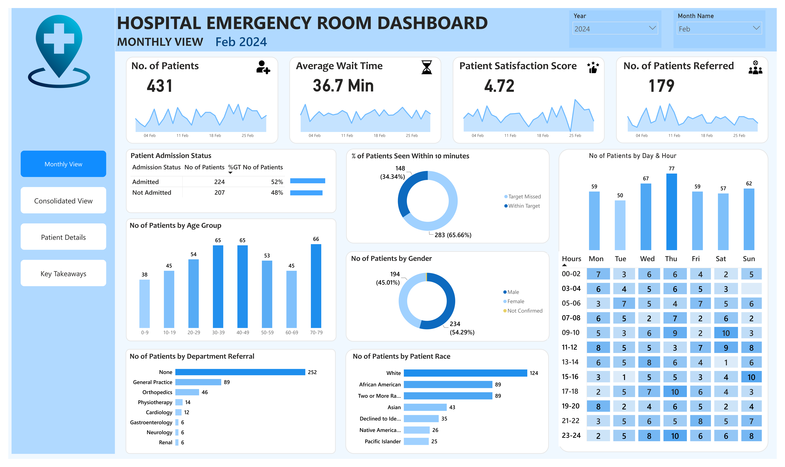
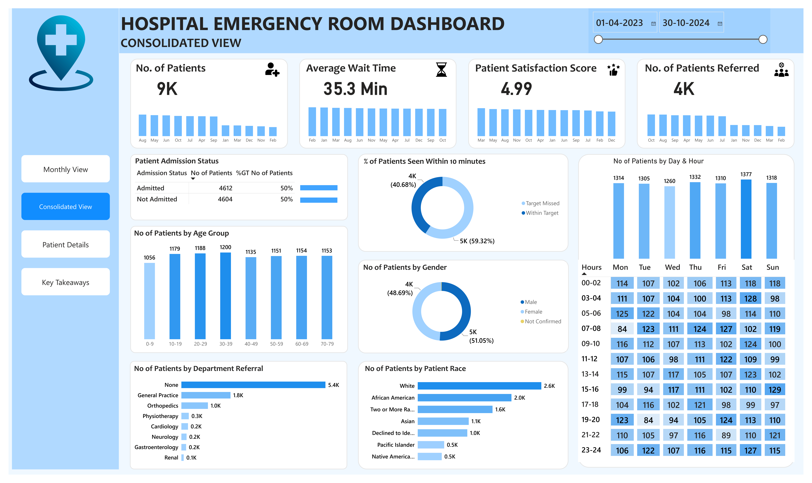
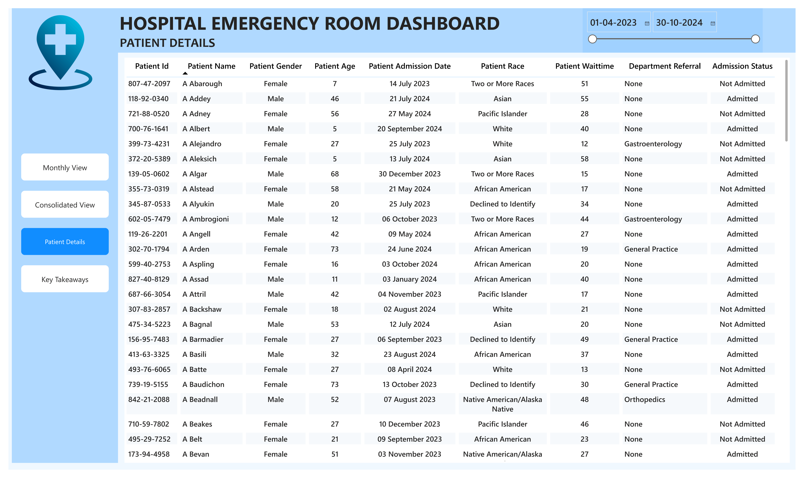
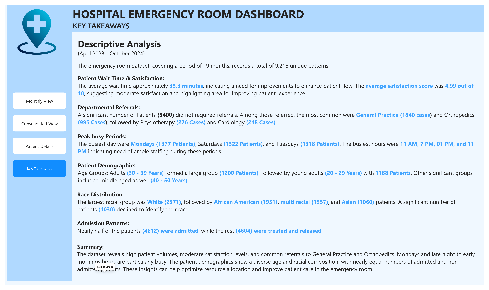

# 🏥 Hospital Emergency Room Analysis & Dashboard

## 📌 Project Overview

This project analyzes **9,216 hospital emergency room patient records** to understand patient demographics, admission patterns, department referrals, waiting times, patient satisfaction, and emergency room activity.

The project was developed using **Power BI**, with Power Query used for data cleaning and transformation, DAX used for calculated columns and KPI measures, and a dedicated Date Table used for time-based analysis.

The final report contains **4 interactive dashboard pages**:

- Monthly View
- Consolidated View
- Patient Details
- Key Takeaways

The analysis is designed to provide both **operational insights and business recommendations** that can support better staffing, patient-flow management, resource allocation, and patient experience.

---

# 🎯 Business Objective

The main objective of this project is to analyze emergency room operations and identify patterns that can help improve efficiency and patient experience.

### Key Business Questions

- How many patients visited the emergency room?
- What percentage of patients were admitted?
- What is the average patient waiting time?
- What is the average patient satisfaction score?
- How many patients were referred to other departments?
- Which departments receive the most referrals?
- What are the busiest days and hours?
- Which age groups have the highest patient volume?
- What is the gender and race distribution of patients?
- How many patients were seen within the defined waiting-time target?
- What operational areas could be improved?

---

# 📊 Dataset Overview

The dataset contains:

- **9,216 patient records**
- **12 columns**
- Patient demographic information
- Admission information
- Department referral information
- Patient satisfaction information
- Waiting-time information

The available patient admission records cover approximately **April 2023 to October 2024**.

---

## 📋 Dataset Columns

| Column | Description |
|---|---|
| Patient Id | Unique identifier assigned to each patient |
| Patient Admission Date | Date and time when the patient was admitted |
| Patient First Initial | First initial of the patient's first name |
| Patient Last Name | Patient's last name |
| Patient Gender | Gender of the patient |
| Patient Age | Age of the patient |
| Patient Race | Race category |
| Department Referral | Department to which the patient was referred |
| Patient Admission Flag | Indicates whether the patient was admitted |
| Patient Satisfaction Score | Patient satisfaction rating |
| Patient Waittime | Patient waiting time in minutes |
| Patients CM | Patient-related measure available in the source dataset |


--- 
## 🔄 Project Workflow
Raw Hospital ER Dataset
          ↓
Import Data into Power BI
          ↓
Data Quality Check
          ↓
Power Query Transformation
          ↓
Standardize Gender Values
          ↓
Create Date Table
          ↓
Create Patient Admission Date
          ↓
Create Data Model Relationship
          ↓
Create Calculated Columns
          ↓
Create DAX Measures
          ↓
Sort Month, Day & Age Group
          ↓
Build Interactive Dashboard
          ↓
Monthly Analysis
          ↓
Consolidated Analysis
          ↓
Patient-Level Details
          ↓
Key Insights
          ↓
Business Recommendations


# 🛠️ Tools & Technologies
| Tool          | Purpose                                      |
| Power BI      | Dashboard development and data visualization |
| Power Query   | Data cleaning and transformation             |
| DAX           | Measures and calculated columns              |
| Data Modeling | Date table and table relationships           |
| CSV	        | Source dataset                               |
| GitHub	    | Project documentation and portfolio          |


---

# 🧹 Data Cleaning & Transformation

The dataset was imported into **Power BI** and reviewed in **Power Query** before building the dashboard.

## Data Quality Checks

The following data-quality checks were performed:

- Reviewed the dataset structure.
- Checked column data types.
- Checked for missing values.
- Reviewed categorical values for consistency.
- Checked patient gender values.
- Reviewed date and time fields.
- Checked numerical fields such as patient age and waiting time.
- Reviewed patient satisfaction values.
- Verified the admission flag.
- Checked the dataset before loading it into the Power BI data model.

## Gender Standardization

The original dataset contained abbreviated gender values.

The following transformations were performed in Power Query:

```text
M  → Male
F  → Female
NC → Not Confirmed
```
---

## 📅 Date Table & Data Modeling

After completing the data cleaning and transformation process, a dedicated **Date Table** was created to support accurate time-based analysis in Power BI.

The Date Table contains the following fields:

- Date
- Year
- Month Number
- Month Name
- Day
- Day Name
- Weekday Number
- Weekday Name
- Quarter

## Creating Patient Admission Date

The original **Patient Admission Date** column contained both date and time.


For example:

```text
20-03-2024 08:47
```

To resolve this, a separate **Patient Admin Date** column was created.
This allowed the dashboard to correctly perform:

- Year analysis
- Month analysis
- Day analysis
- Monthly filtering
- Date-range filtering
- Time-based analysis

## Sorting Columns
- Month Name Sorting - The Month Name column was sorted using Month Number Column.
- Day Name - The Day Name column was sorted using Weekday column.
- Age Group Sorting - The Age Group column was sorted using a numeric sort column.

## 📌 KPI Measures

- No. of Patients
- Avg Wait Time
- Patient Satisfaction Score
- No. of Patients Referred


## 🧮 Calculated Columns

- Admission Status - The original Patient Admission Flag was converted into a more user-friendly category.
- Age Group - Patients were categorized into age groups to make demographic analysis easier.
- Admission Hour - The hour was extracted from the patient admission datetime to analyze emergency room activity throughout the day.
- Wait Time Status - A 30-minute waiting-time target was used to classify patient waiting times.


## 📊 Power BI Dashboard

### 1️⃣ Monthly View

The Monthly View provides a detailed analysis of emergency room activity for a selected year and month.

Filters
Users can select:
- Year
- Month Name
- The dashboard dynamically updates based on the selected period.

KPI Cards
The page contains:

- No. of Patients
- Average Wait Time
- Patient Satisfaction Score
- No. of Patients Referred

For example, the February 2024 view shows:
- 431 patients
- 36.7 minutes average wait time
- 4.72 average satisfaction score
- 179 referred patients

Visualizations

The Monthly View contains:
- Patient Admission Status
- % of Patients Seen Within 10 Minutes
- Patients by Age Group
- Patients by Gender
- Patients by Department Referral
- Patients by Patient Race
- Patients by Day & Hour

This page allows users to drill into monthly emergency room activity.

### 2️⃣ Consolidated View

The Consolidated View provides an overall analysis across the available date range.

KPI Cards

The dashboard shows approximately:
- 9K patients
- 35.3 minutes average wait time
- 4.99 average satisfaction score
- 4K referred patients
- Admission Status

The overall admission distribution is:
| Admission Status | Patients |	Percentage
| Admitted	       | 4,612    |	50%
| Not Admitted	   | 4,604	  | 50%

The results indicate an almost equal split between admitted and non-admitted patients.

Other Analysis
The Consolidated View includes:

- Patient volume by age group
- Patient distribution by gender
- Department referral analysis
- Patient race distribution
- Patients by day
- Patients by hour
- Patients within the waiting-time target

A date-range slicer allows users to analyze different periods.

### 3️⃣ Patient Details

The Patient Details page provides a patient-level view of the underlying data.

The table contains:
- Patient ID
- Patient Name
- Patient Gender
- Patient Age
- Patient Admission Date
- Patient Race
- Patient Wait Time
- Department Referral
- Admission Status

This page allows users to move from high-level dashboard KPIs to individual patient records.

### 4️⃣ Key Takeaways

The Key Takeaways page summarizes the major findings from the analysis.


---

## 🖼️ Dashboard Preview

### 📅 Monthly View



### 📊 Consolidated View



### 👤 Patient Details



### 💡 Key Takeaways




## 💡 Key Insights
1. Patient Volume & Admission
- The emergency room handled 9,216 patient visits during the analyzed period.
- 4,612 patients (50%) were admitted, while 4,604 patients (50%) were not admitted.
- The almost equal admission split indicates that the emergency department manages a substantial volume of both admitted and non-admitted patients.
2. Waiting Time & Patient Experience
- The overall average patient waiting time was approximately 35.3 minutes.
- 59.32% of patients were seen within the 10-minute target, while 40.68% exceeded the target.
- The average patient satisfaction score was approximately 4.9 out of 10.
- The combination of waiting-time performance and moderate satisfaction indicates an opportunity to improve patient flow and overall patient experience.
3. Department Referrals
- Approximately 5,400 patients did not require a department referral.
- Among referred patients, General Practice had the highest referral volume with 1,840 cases.
- Orthopedics followed with 995 cases.
- Physiotherapy and Cardiology accounted for 276 and 248 cases respectively.
- The high concentration of referrals in General Practice and Orthopedics indicates greater demand for these services.
4. Peak Patient Days & Hours

The busiest days were:

- Monday — 1,377 patients
- Saturday — 1,322 patients
- Tuesday — 1,318 patients

The hourly analysis also highlights periods of higher patient activity, particularly around:

- 11 AM
- 1 PM
- 7 PM
- 11 PM

These patterns can help identify periods that may require additional staffing and resources.

5. Patient Demographics

The largest age groups were:

- 30–39 years — 1,200 patients
- 20–29 years — 1,188 patients
- 50–59 years — 1,151 patients
- 60–69 years — 1,154 patients
- 70–79 years — 1,153 patients

Patient volume is distributed across multiple adult age groups rather than being concentrated in one specific age range.

6. Race Distribution

The largest race groups were:

- White — 2,571 patients
- African American — 1,951 patients
- Two or More Races — 1,557 patients
- Asian — 1,060 patients
- Declined to Identify — 1,030 patients

This provides an overview of the demographic composition of the emergency room population.

7. Overall Operational Picture

The analysis shows:

- High emergency room patient volume.
- An almost equal admission and non-admission split.
- Average waiting time above 30 minutes.
- A significant proportion of patients exceeding the 10-minute target.
- High referral demand for General Practice and Orthopedics.
- Specific days and hours with higher patient activity.
- Moderate overall patient satisfaction.

These findings highlight opportunities for better staffing, patient-flow management, and resource allocation.

## 💼 Business Recommendations
1. Optimize Staffing During Peak Periods

Adjust staffing levels around high-volume days such as Monday and Saturday and during identified peak hours.

Expected benefit: Better capacity management and potentially shorter patient waiting times.

2. Improve Patient Flow

Investigate bottlenecks across the emergency room process, including:

- Registration
- Initial assessment
- Triage
- Consultation
- Department referral
- Treatment

Expected benefit: Reduce unnecessary delays and improve the percentage of patients seen within the target.

3. Prioritize High-Demand Departments

Review staffing and resource requirements for General Practice and Orthopedics, which have the highest referral volumes.

Expected benefit: Better handling of referral demand and reduced departmental congestion.

4. Monitor Waiting-Time Performance

Track the Within Target vs Target Missed metric regularly and analyze it by:

- Day
- Hour
- Month
- Department
- Patient group

Expected benefit: Identify when and where waiting-time problems occur.

5. Improve Patient Experience

Monitor patient satisfaction alongside:

- Waiting time
- Admission status
- Department referral
- Patient demographics

Expected benefit: Identify operational factors that may contribute to lower patient satisfaction.

6. Use Historical Trends for Resource Planning

Use day-of-week and hourly patient-volume trends to support:

- Staff scheduling
- Resource allocation
- Department capacity planning
- Emergency room workload management

Expected benefit: Move toward more data-driven workforce and resource planning.


## 📊 Dashboard Features
- Interactive Year filter
- Interactive Month filter
- Date-range filtering
- KPI cards
- Admission analysis
- Waiting-time analysis
- Patient satisfaction analysis
- Department referral analysis
- Age-group analysis
- Gender analysis
- Race analysis
- Day-of-week analysis
- Hourly analysis
- Day & Hour heatmap
- Patient-level detail table
- Within Target vs Target Missed analysis
- Dedicated Key Takeaways page

## 🎨 Dashboard Design

The dashboard uses a clean healthcare-inspired visual design with:

- Light blue background
- Consistent blue accent colors
- KPI cards for quick performance monitoring
- Clear section headings
- Interactive slicers
- Consistent chart formatting
- Navigation buttons between dashboard pages

## 🚀 Key Skills Demonstrated
- Data Preparation
- Data Quality Checking
- Data Cleaning
- Data Transformation
- Missing Value Analysis
- Categorical Standardization
- Date/Time Transformation
- Power BI
- Dashboard Development
- Interactive Filtering
- Data Modeling
- Date Table Creation
- Relationships
- KPI Development
- Conditional Analysis
- Dashboard Navigation
- DAX
- Measures
- Calculated Columns
- IF Logic
- Aggregations
- Percentage Calculations
- Time-Based Analysis
- Data Visualization
- KPI Cards
- Bar Charts
- Donut Charts
- Line Charts
- Heatmaps
- Tables
- Slicers
- Interactive Dashboard Design
- Business Analysis
- Patient Flow Analysis
- Admission Analysis
- Waiting-Time Analysis
- Patient Satisfaction Analysis
- Department Referral Analysis
- Demographic Analysis
- Operational Analysis
- Insight Generation
- Business Recommendations

## 📚 Project Documentation

Additional documentation is included to provide deeper context about the project and the terminology used in the analysis.

- 📄 **Data Terminology Guide** – Contains explanations and definitions of important healthcare and data analytics terminology used in the project.
- 📊 **Project Presentation** – Provides a visual overview of the project, dashboard, key findings.

These resources can be found in the `Documentation/` folder.


--- 

## 📌 Conclusion

This project demonstrates an end-to-end Power BI healthcare analytics workflow, starting from a raw emergency room dataset and progressing through data-quality checks, Power Query transformation, date modeling, DAX calculations, visualization, and business analysis.

The four-page dashboard provides both high-level management insights and patient-level details, allowing users to analyze:

- Patient volume
- Admission patterns
- Waiting times
- Patient satisfaction
- Department referrals
- Demographics
- Day and hourly activity
- Waiting-time target performance

The findings highlight opportunities to optimize staffing, improve patient flow, manage high-demand departments, monitor waiting-time performance, and enhance patient experience.


## ⭐ Portfolio Highlights

- 9,216 Patient Records
- 12 Dataset Columns
- 4 Interactive Power BI Pages
- Power Query Data Cleaning
- Date Table & Data Modeling
- DAX Measures & Calculated Columns
- Healthcare Operations Analysis
- Business Insights & Recommendations

## 👨‍💻 Project Type

Data Analytics | Healthcare Analytics | Power BI Dashboard | Business Intelligence
